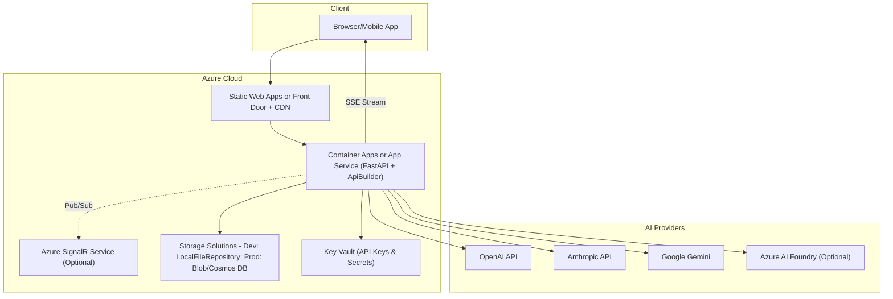
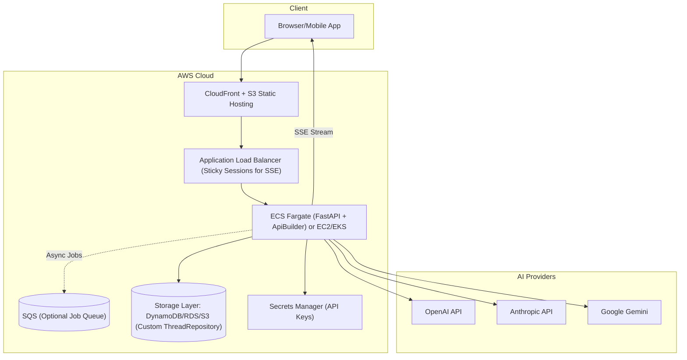

# Cloud Deployment Guide

## Overview

This guide provides production-ready deployment architectures for the Siili Agent SDK on major cloud platforms. Both configurations support full SSE streaming, horizontal scaling, and enterprise security requirements.

## Azure Deployment Architecture

### Architecture Diagram



### Azure Implementation Details

#### Frontend Hosting
- **Static Web Apps**: Ideal for React frontends with automatic CI/CD from GitHub/Azure DevOps
- **Azure Front Door + CDN**: Global distribution with edge caching and DDoS protection

#### Backend Services
- **Container Apps**: Serverless containers with automatic scaling and built-in Dapr support
- **App Service**: Traditional PaaS with predictable pricing and enterprise features

#### Storage Options
- **Development**: LocalFileThreadRepository on persistent volumes
- **Production**: Cosmos DB

## AWS Deployment Architecture

### Architecture Diagram



### AWS Implementation Details

#### Frontend Hosting
- **CloudFront + S3**: Cost-effective static hosting with global CDN
- **Route 53**: DNS management with health checks and failover

#### Backend Services
- **ECS Fargate**: Serverless containers with automatic scaling
- **ALB Configuration**: 
  ```yaml
  # Enable sticky sessions for SSE
  TargetGroupAttributes:
    - Key: stickiness.enabled
      Value: true
    - Key: stickiness.type
      Value: app_cookie
    - Key: deregistration_delay.timeout_seconds
      Value: 30
  ```

#### Storage Options
- **DynamoDB**: NoSQL for thread storage with automatic scaling


## Migration Path

### Development → Cloud
1. Replace `DummyAuthorizer` with real authentication
2. Switch from LocalFileRepository to cloud storage
3. Enable monitoring and logging
4. Configure backup strategies
