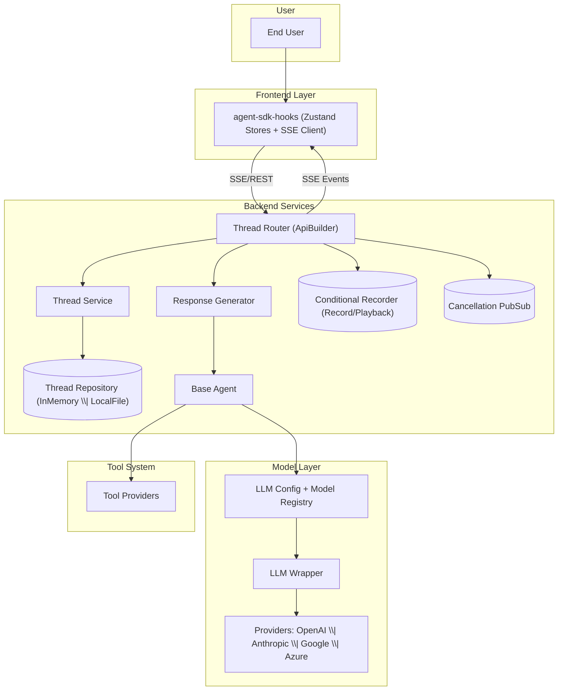
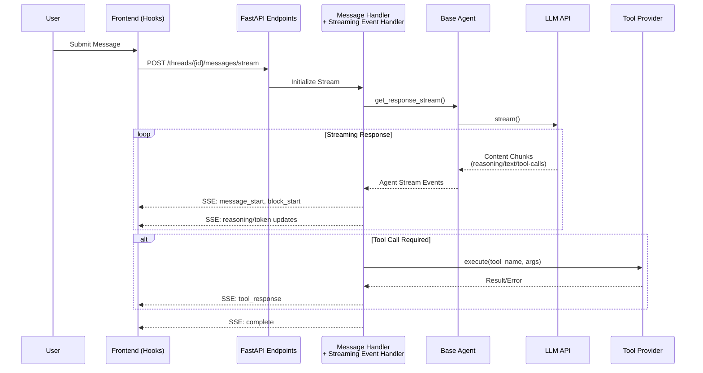

# Siili Agent SDK - System Architecture

## Overview

The Siili Agent SDK provides a comprehensive framework for building AI-powered applications with streaming capabilities, multi-provider support, and production-ready infrastructure patterns.

## High-Level System Architecture



### Key Components

- **Frontend Layer**: React hooks with Zustand state management and SSE client for real-time streaming
- **Backend Services**: FastAPI-based thread management with pluggable storage and recording capabilities
- **Model Layer**: Unified interface supporting multiple LLM providers with configuration registry
- **Tool System**: Extensible tool provider framework for agent capabilities

## Streaming and Tool Execution Flow



### Event Types and Block Structure

The streaming pipeline intelligently separates content into distinct block types:

- **Reasoning Blocks**: Internal model thinking process (when supported)
- **Text Blocks**: User-facing content and responses
- **Tool Use Blocks**: Function calls with parameters and results
- **Error Blocks**: Structured error handling and recovery

## Storage Architecture

The SDK provides a flexible storage interface with multiple implementations:

### Development Storage
- **InMemoryThreadRepository**: Fast, ephemeral storage for testing
- **LocalFileThreadRepository**: File-based persistence for local development

### Production Storage
- Pluggable interface for custom implementations
- Support for cloud storage solutions (DynamoDB, Azure Storage, etc.)
- Thread versioning and conflict resolution
- Audit logging capabilities

## Provider Abstraction

The model layer abstracts provider differences through a unified interface:

```
ModelRegistry
    ├── OpenAI Provider
    │   ├── OpenAI models
    ├── Anthropic Provider
    │   ├── Claude models
    ├── Google Provider
    │   └── Gemini models
    └── Azure Provider
        └── Azure AI Foundry integration
```

## Security and Authentication

- Pluggable authentication system with `DummyAuthorizer` for development
- Production-ready auth interfaces for:
  - OAuth 2.0 / OIDC
  - API key management
  - JWT token validation
  - Rate limiting and quota management

## Recording and Playback

The ConditionalRecorder system enables:
- Capture of complete interaction streams
- Deterministic replay for testing
- Performance benchmarking
- Compliance and audit trails
- Demo and training content creation

## Prompt Management

The SDK uses a pluggable prompt loading and formatting system.

- **Interface**: `PromptLoader` defines the API for loading raw prompts and formatting them with parameters.
- **Default implementation**: `LocalPromptLoader` reads `.md` files from `PROMPTS_DIR` (defaults to `prompts`).
- **Agent prompt resolution**:
  - Files are resolved by agent class and prompt name: `prompts/agent/<AgentClass>/<promptName>[-<version>].md`.
  - Example system prompt path for `DemoAgent`: `prompts/agent/DemoAgent/system.md`.
- **Templating**: simple Python `str.format`-style variables. Missing keys raise a clear error.
- **Configuration**:

```env
PROMPT_LOADER_MODE=local
PROMPTS_DIR=prompts
```

- **Extensibility (3rd‑party prompt platforms)**:
  - Implement a new loader by subclassing `PromptLoader` and overriding `_load_raw_prompt`.
  - Add a new value to `PromptLoaderMode` and route it inside `get_prompt_loader(...)`.
  - Your loader can fetch from any source (e.g., internal service, versioned DB, or external prompt management SaaS) and return raw prompt text.

This design lets you plug in a remote prompt store without changing agent/business logic.

## Tracing

Tracing captures a timeline of the agent’s behavior for debugging, observability, and demos.

- **Component**: `AgentTrace` collects timestamped steps and can persist them to disk.
- **What gets traced**:
  - User input
  - Model output blocks: plain text, reasoning, tool calls, and errors
  - Structured I/O: requested schema and parsed output
- **Default behavior**:
  - Automatically wired by `BaseAgent`.
  - Saves continuously to `traces/<AgentClass>.txt` and `traces/<AgentClass>_system_prompt.txt`.
- **Extensibility (external tracing systems)**:
  - Provide a custom `trace` instance to `BaseAgent` that implements the same methods (`add_input`, `add_block`, `add_structured_response_input`, `add_structured_response_output`).
  - Your implementation can forward events to external backends (e.g., APM/observability tools, internal logging services) and/or change persistence strategy.

This keeps tracing concerns decoupled from core agent logic while enabling integrations with your preferred telemetry stack.